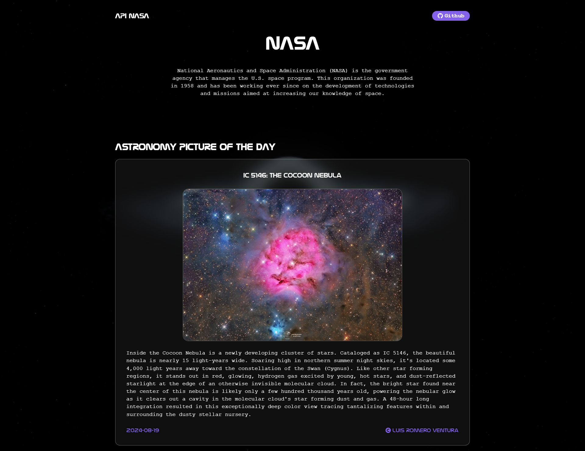

# Nasa

The NASA API provides access to a wide range of data and resources related to space, astronomy and planetary science.

## ⚙️ Function of the website

- Astronomy Picture Of the Day: Each day a different image or photograph of our fascinating universe is featured, along with a brief explanation written by a professional astronomer.

## 🚀 Technologies and tools used

- [ReactJS](https://es.react.dev/).
- [Vite](https://vitejs.dev/).
- [Sass](https://sass-lang.com/).
- [React-icons](https://www.npmjs.com/package/react-icons).
- Api: [Nasa](https://api.nasa.gov/).

## 📊 Project status

<!-- ✅ Completed -->

## 🌐 Website

